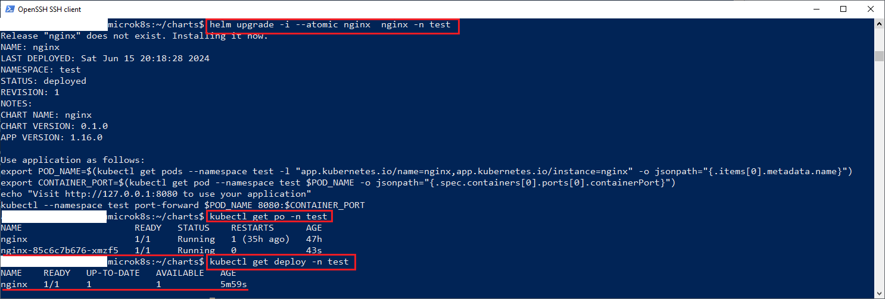
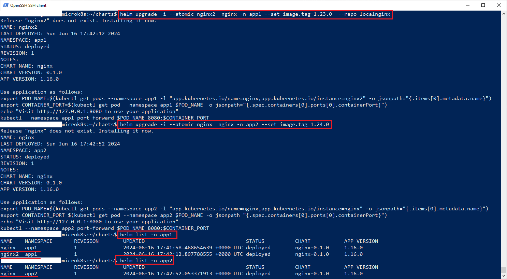
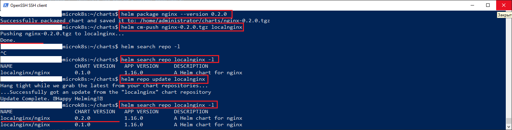

### Инструменты и дополнительные материалы, которые пригодятся для выполнения задания

1. [Инструкция по установке Helm](https://helm.sh/docs/intro/install/) . 
2. [Добавление helm-автоподстановки в среду выполнения скриптов](https://helm.sh/docs/helm/helm_completion/). Конструкции типа ```source <(helm completion bash)```
3. [Полезная инструкция по разработке helm-чартов](https://helm.sh/ru/docs/intro/using_helm/)
4. [Публикация в репозиторий Gitlab](https://docs.gitlab.com/ee/user/packages/helm_repository/)
------

### Задание 1. Подготовить Helm-чарт для приложения

1. Необходимо упаковать приложение в чарт для деплоя в разные окружения. 
2. Каждый компонент приложения деплоится отдельным deployment’ом или statefulset’ом.
3. В переменных чарта измените образ приложения для изменения версии.

### Решение 1

1. Можно создать чарт двумя способами
  - Командой ```helm create <name>```
  - Скачать чарт с чарт-репозитория
    1. Добавить чарт репозиторий, найдя чарт на сайте https://artifacthub.io и скопировав команду добавления репозитория из закладки *Install*, к примеру так:
        ```helm repo add bitnami https://charts.bitnami.com/bitnami```
    2. Качаем чарт из репозитория:
        ```helm pull  bitnami/nginx```
    3. Разархивируем чат в папку nginx, которую предварительно создаем:
        ```mkdir nginx && tar -xvzf nginx.tgz -C nginx```   
2. Чарт приложения nginx находится в [папке](charts/nginx)
3. В папке в которой создали папку с чартом выполяем команду инсталляции чарта:
  ```helm upgrade -i --atomic nginx  nginx -n test --set image.tag=1.23.0```
4. Процесс установки представлен на скриншоте ниже: 
    
------
### Задание 2. Запустить две версии в разных неймспейсах

1. Подготовив чарт, необходимо его проверить. Запуститe несколько копий приложения.
2. Одну версию в namespace=app1, вторую версию в том же неймспейсе, третью версию в namespace=app2.
3. Продемонстрируйте результат.

### Решение 2

1. Создаем namespace командой
  ```
    kubectl create ns app1
    kubectl create ns app2
  ```
2. Запускаем релизы чарта на основе разных версий  образа nginx. Используем для поиска второго релиза nginx в app1 репозиторий localnginx(см. раздел дополнительная публикация чарта в репозиторий gitlab):
  ```
    helm upgrade -i --atomic nginx  nginx -n app1 --set image.tag=1.22.0 
    helm upgrade -i --atomic nginx2  nginx -n app1 --set image.tag=1.23.0  --repo localnginx  
    helm upgrade -i --atomic nginx3  nginx -n app2 --set image.tag=1.24.0
  ```
3. В итоге получаем список релизов в неймспейсах *app1* и *app2*:
```
   helm list -n app1
   helm list -n app2
```
Результат выполнения команд представлен на скриншоте. Команды выделены красным:


### Установка Helm

#### Способ 1

- Скачиваем скрипт get_helm.sh:
   ```curl -fsSL -o get_helm.sh https://raw.githubusercontent.com/helm/helm/main/scripts/get-helm-3```
- Выставляем права доступа на запуск скрипта:
   ```chmod 700 get_helm.sh```
- Запускаем скрипт находясь в текущей папке скрипта:
   ```./get_helm.sh```

#### Способ 2

- Скачиваем ключ в папку **/etc/apt/keyrings**:
   ```curl https://baltocdn.com/helm/signing.asc | sudo gpg --dearmor -o /etc/apt/keyrings/helm.gpg```
- Прописываем ключ и путь до репозитория в папке **/etc/apt/sources.list.d**:
  ```echo "deb [arch=$(dpkg --print-architecture) signed-by=/etc/apt/keyrings/helm.gpg] https://baltocdn.com/helm/stable/debian/ all main" | sudo tee /etc/apt/sources.list.d/helm-stable-debian.list```

- Устанавливаем обязательный пакет:
  ```sudo apt-get install apt-transport-https -y```

- Устанавливаем helm:
   ```apt install helm -y```

### Дополнительая публикация helm-чарта в репозиторий gitlab

1. Необходимо установить плагин helm, чтобы появилась возможность вызывать команду публикации чартов ```helm cm-push```. Установка последней версии плагина выполняется командой:
  ```helm plugin install https://github.com/chartmuseum/helm-push```
2. Добавляем собственное хранилище чартов на основе Gitlab:
  ```helm repo add localnginx --username root --password <accesstoken>  https://gitlab.example.com/api/v4/projects/<project_id>/packages/helm/stable```
Здесь localnginx это название, которое мы дали хранилищу чартов проекта на локальной машине.
3. Запаковываем чарт командой(при условии существования папки nginx в текущем каталоге):
  ```helm package nginx```
Получаем файл *nginx-<Chart.version>.tgz*
4. Публикуем пакет чарта в хранилище(если делать через CI/CD, то делаем на основе команды  ):
- через CI/CD: 
  ```curl --request POST --user <username>:<accesstoken> --form "chart=nginx-0.1.0.tgz" https://gitlab.example.com/api/v4/projects/<project_id>/packages/helm/stable```
- через bash: 
  ```helm cm-push nginx-<Chart.version>.tgz localnginx```
5. Для загрузки пакетов предварительно выполняем команду ```helm repo update``` иначе можем не увидеть загруженный пакет(получим командой ```helm search repo localnginx```  результат - No resource found)

Процесс запаковки и публикации чарта выглядит так:

